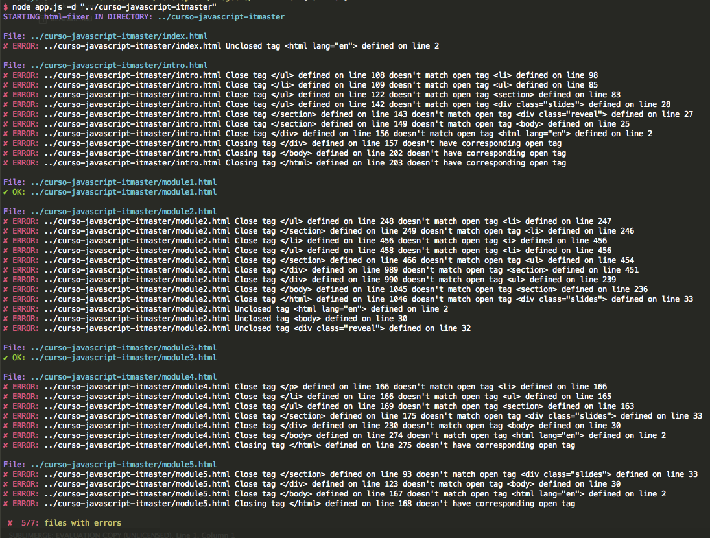

# html-fixer
NodeJS command line tool for check html files and detect improperly closed tags.

### Installation 

Open your terminal and type: 
```
npm install -g html-fixer
```

### Usage

Open your terminal and type: 
```
html-fixer -d "my/html/directory"
```

### Output

<p style="text-align: center">
  
</p>
